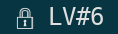
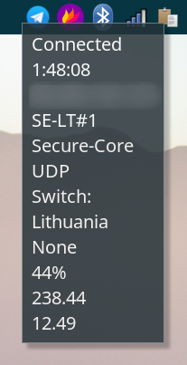

# Protonvpn module for polybar
## Preview

| VPN active  | VPN active (with Secure Core) |
| --- | --- |
|  |  |

Leftclicking the module will show the status via `notify-send`



## Dependencies
* [nerdfont](https://github.com/ryanoasis/nerd-fonts) (lock emoji)
* [protonvpn](https://github.com/ProtonVPN/linux-cli)

## Usage

Create a custom module in your polybar config file:
```
[module/protonvpn]
type = custom/script
exec = ~/path/to/folder/polybar-protonvpn.sh
click-left= exec ~/path/to/folder/status-notification.sh
interval = 5
```
